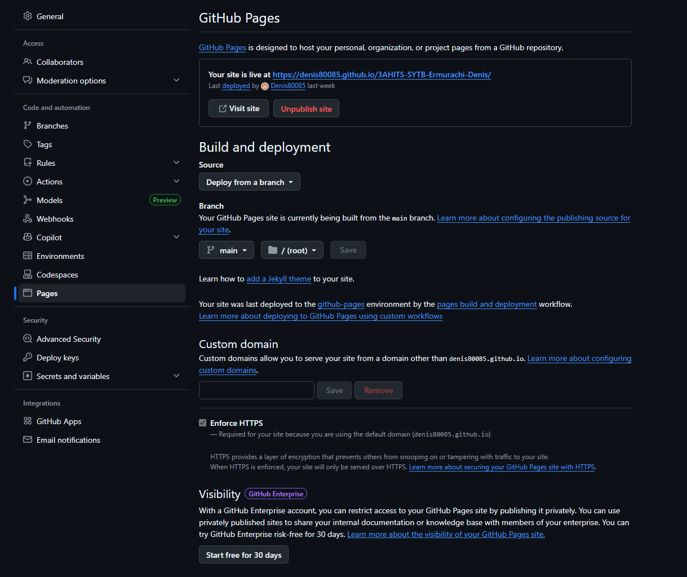
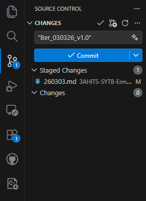

# Arbeitsbericht

- Name: Denis Ermurachi
- Datum: 03.03.2026
- Thema: Github, VSCode
- Fach: SYTB
- Klasse: 3AHITS

### neues Github Repository anlegen

1) Ein github konnto einlegen unter <a href="https://github.com">link</a>

2) Auf <span style="cursor:default; display:flex inline; width:fit-content; color:white; background: #238636; padding:4px 5px; border-radius: 6px;"><svg xmlns="http://www.w3.org/2000/svg" width=20 viewBox="0 0 448 560"><path fill="white" d="M392 8.5c5.9 .4 11.1-.2 19 2.7 5.1 1.5 8.3 6.2 9.2 11.2 .3 4.1 .4 6.9 .4 9.5l.2 16.6 1.5 66.3 3.3 132.8 .6 66.5-.2 33.3-.8 39.9c.1 .7 .4 1.3 .4 2l.9 61.5 .7 15.3 0 .1c0 5.7 1.2 9.3-.5 18-1.1 4.7-4.5 8.7-9.2 9.9-5.6 1.2-7.8 .6-10.3 .8l-15.5 .2-123.5 1.4c-3.4 0-6.7-.5-9.4-1.6l-1.3-.5c-1.8-.7-2.4-2-1.6-3.1l5.1-6.6c1.3-1.7 4.5-2.8 8-2.9l124.6-1.5 15.6-.2c3.7 0 2.6 0 3-.1 .2-.4 .1 .1 .2-1 .4-8.2-1-19.9-1-30.2l-.7-48.9-5.7 .4c-2.5 .9-5.7 1.7-9.5 1.8-64.7 1.5-129.4 3.7-194.3 3.5-32.4-.1-65-.7-97.4-2.4-7.8-.3-17-1.2-23.5-1-7 .3-13.9 2.1-20.2 5.2-12.5 6.1-22.7 17.7-25.8 30.7-.1 .5-.3 .8-.4 1.3 .4 3.5 1 7.1 2.5 10.4 7 16.5 24.2 27.5 42.7 30.6 9.3 1.6 19.9 1.2 26.7 2.3 .9 .1 1.6 .2 2.4 .3 .6-10.8 1.4-21.6 2-32.4 .3-4.3 1.2-8.4 2.5-11.7l-.3-.2c-.8-.7-1.1-2-.7-3.1l2.4-6.6c.6-1.7 2.1-2.8 3.8-2.9l117.6-2.7c.8 0 1.6 .3 2.1 1 .4 .5 .6 1.2 .6 1.9l1.1 .4c2 .7 2.9 5.1 2.6 10.3-2.2 28.5 1.2 56.8 .8 87.1-.3 3.9-.5 7.8-1.5 12.2-.7 3.9-4.2 11.9-11 13.5-7.1 1.4-13-1.7-16-3.7-3.7-2.3-6.7-4.7-9.7-7.2-5.8-5-11.1-10.3-16.2-15.7l-7.5-8.1c-2.2-2.7-2.8-2.4-4-2.8-.6-.4-8.1 4.2-12.5 8l-15.4 13-7.8 6.7-4 3.3-2 1.7c-1 .9-2.5 1.8-3.7 2.6-5 4.2-10.8 5.7-15.5 1.8-4.3-2.7-6.3-11.4-6.9-15.5-1.6-14.2-1.7-27.7-1.2-41.1l-.4 .4c-1 1-6.8 1.7-15.4 2.1-8.3 .9-21-.2-33.4-5.5-20.3-8.3-38-27.2-39.9-50.9-.3-4.2 0-8.4 .7-12.4 0-.4-.2-.7-.2-1.1L23 248.5c0-1.2 .4-2.3 1.1-3.1 .1-.1 .2-.1 .4-.2 .1-10 .1-20-.1-30L22.6 82.8c.1-11-.9-22.1-.3-34 .5-5.9 1.3-12.2 4.1-18.5 2.6-6.3 8.1-12.3 14.4-15.1 12.4-5.8 25-5.1 35.7-5.1l33.2 .3 132.7 0 132.8-2.1 16.8 .1zm-270.4 432l1.3 1.6c1.5 2 2.3 6.4 1.9 11.3-1.7 26.4-4.2 54-1.1 78.7 .1 1.9 1 2.2 1.8 1.3 9.2-7.8 19.2-16.1 29.8-25.1 2.8-2.2 5.5-4.3 8.7-6.4 3.3-1.8 6.6-4.6 13.6-4.7 3.4 .3 6 1.2 8.7 2.7 2.6 1.4 4.9 4.2 5.8 5.1l7.4 8c5 5.3 10.2 10.4 15.5 14.8l0 .1c14.4 9.9 11 11 13.1-6.6 .1-26.5-2.6-54.8-.8-83.1l-105.6 2.3zM372 23.2l-133.9 2-133.9-.1C82.9 26 56.3 21.4 44 30.7l0 0c-5.5 4.3-7.1 14.6-7.2 25l.6 33 1.7 134.2c.5 44.7-2.2 89.2-3.1 133.9-.3 9.4-.7 18.7-1.2 27.5l-.3 11.8c5-5.4 10.9-9.9 17.4-13.2 10-5.3 21.4-7.6 32.6-7.3l30.4 1.6c20.1 1 40.2 1.4 60.3 1.6 40.3 .3 80.6-.7 121-2l114.5-3.5 .7-59.9-.6-66.8-3.3-133.8-1.5-67-.2-16.8c-.6-6.4 1.1-3.8-2.1-5-8.9-1.4-20.8-1.1-31.6-1zm-90.3 95c.7 0 1.3 .3 1.8 1 .4 .6 .6 1.5 .5 2.3l-.8 8c-.2 2-1.6 3.5-3.2 3.6l-101.4 2.4c-1.4 0-2.8-.6-3.9-1.7l0 .1-.6-.5c-.7-.7-1-2-.7-3.1l1.9-6.6c.5-1.7 1.8-2.8 3.3-2.8l103.1-2.6z"/></svg> New</span>drucken

3) In dem geöffneten Fenster muss man einen Reopsitory Name eingeben und man soll auf jedem fall __<mark>Add Readme</mark>__ einhackeln

4) Schließlich auf <span style="cursor:default; color:white; background: #238636; padding:4px 5px; border-radius: 6px">Create Repository</span> drucken

5) um Git Pages einzustellen, muss man ins Repository Setting gehen und die Option "Pages" auswählen

6) Hier sucht man sich einen Branch (z.B. main) und ein Folder (z.B. root) aus. Zum Schluss klickt man auf <span style="cursor:default; color:white; background: grey; padding:2px 3px; border-radius: 6px">Save</span>. __Siehe das Bild:__ 

7) In oberen Kästchen mit dem Text "Your sit is live at ..." findet man den Link zu der Website, wo die Berichte gehostet werden.

### Repository in VS Code clonen

> Anforderungen: Visual Studio Code und Git sind bereits installiert

1) Erstens öffnet man VS Code in eine belibige Verzeichniss

2) Mit dem folgendem befehl verbindet man die Repository vom Github mit VS Code
```bash
$ git clone https://github.com/Username/Repository_Name.git
```
>  Der Link zum Repository findet man auf der Githabpage und auf <span style="cursor:default; display:flex inline; width:fit-content color:white; background: #95e9a6; padding:4px 5px; border-radius: 6px;">Code</span> drucken

3) Bevor man anfängt, neue Berichte zu schreiben, muss man noch 2 globale variabeln configurieren (username und email), damit man die alle änderungen auf Github mittels push absiechern kann. Befehle:
```bash
$ git config --global user.name "John Doe" 
$ git config --global user.email "john@doe.com"
```

4) Jetzt kann in der git Verzeichniss neue Datei erfassen. Um sie local zu speichern, verwendet man folgenden Befehl:
```bash
$ git add --all
```
Danach muss man die änderungen commiten. Das ist wichtig jede neue version passend zu bennen, damit man sie einfach finden kann. Später kann man die ältere Versionen wiederherstellen. Commit erfolgt mit der Git-Tool von VS Code, dass sich auf der linke Bar-Menü befindet. Die Option sieht wie eine Linie mit einer Abzweigung aus. In dem Text-Feld "Message" beschriftet man der Commit. Schließlich druckt man die Blaue Taste und alle änderungen zu commiten und zwieten mall druckt man die Blaue taste um die Änderungen zu pushen.

__Siehe Bild:__

