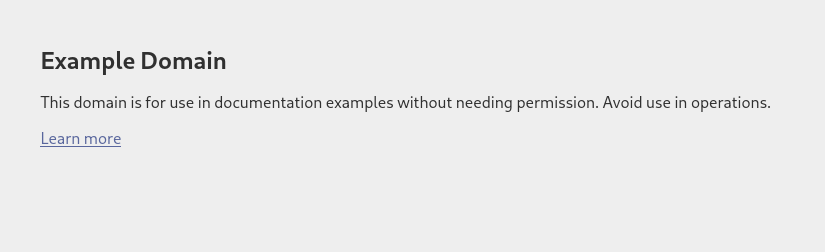

# Arbeitsbericht

- Name: Denis Ermurachi
- Datum: 10.03.2026
- Thema: cURL
- Fach: SYTB
- Klasse: 3AHITS

## Aufgaben

1)  Rufe die Startseite von <mark>example.com</mark> mit __curl__ ab. Du siehst den HTML Code der Seite im Terminal. Vergleiche dazu die Ansicht im Web-Browser.

    __Befehl:__
    ```bash
    $ curl example.com
    ```

    __Reasponse in Terminal__
    ```html
    <!doctype html>
    <html lang="en">
    <head>
        <title>Example Domain</title>
        <meta name="viewport" content="width=device-width, initial-scale=1">
        <style>
            body {
                background: #eee;
                width: 60vw;
                margin: 15vh auto;
                font-family: system-ui, sans-serif;
            }
            h1 {
                font-size: 1.5em;
            }
            div {
                opacity: 0.8;
            }
            a:link, a:visited {
                color: #348;
            }
        </style>
    </head>
    <body>
        <div>
            <h1>Example Domain</h1>
            <p>This domain is for use in documentation examples without needing permission. Avoid use in operations.</p>
            <p><a href="https://iana.org/domains/example">Learn more</a></p>
        </div>
    </body>
    </html>
    ```

    __Im Browser:__
    
    Im Browser habe ich keinen zugrif auf [example.com](example.com)