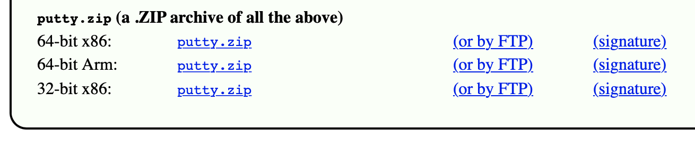
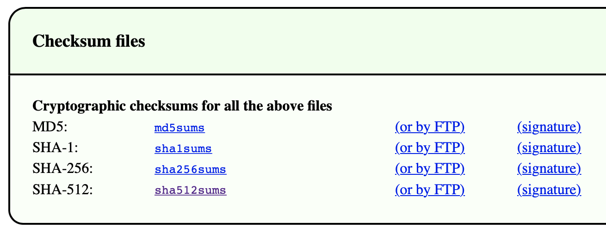

# Arbeitsbericht

- Name: Denis Ermurachi
- Datum: 12.05.2026
- Thema: Download mit automatisierter Hash/Checksum Überprüfung
- Fach: SYTB
- Klasse: 3AHITS

---

#### Übung (Secure Download)

PuTTY ist als SSH Client für Windows sehr beliebt. Genauso beliebt ist aber auch einen Trojaner in einem PuTTY Download zu verstecken. Um das zu verhindern werden Downloads gerne mit einem Hashwert (in diesem Zusammenhang auch **Checksum** genannt) abgesichert.

- Schreibe ein Script das einen Download der `64-bit x86` Variante von `putty.zip` durchführt. [Webseite von PuTTY](https://www.chiark.greenend.org.uk/~sgtatham/putty/latest.html).



- Gleichzeitig soll die Datei mit den SHA-512 checksums geladen werden. Diese sind ganz am Ende der Seite. Die passende Zeile im File `sha512sums` ist mit `w64/putty.zip` am Ende gekennzeichnet.



Im Script soll automatisiert geprüft werden ob die Checksum (=SHA-512 Hash) des geladenen Files mit der Checksum aus dem Checksumfile übereinstimmt. Also zum Beispiel eine Ausgabe kommen: `HASH OK`.

- Das Script erwartet lediglich `putty.zip` im gleichen Directory
- Das checksum file soll das Script live von der PuTTY Seite laden und im `/tmp` Directory ablegen. Das Script erzeugt dafür mit `mktemp` ein Unterverzeichnis. Alle Zwischenergebnisse sollen ebenfalls in diesem temp directory abgelegt werden.

Eine Liste aller u.U. brauchbarer Tools:

- `curl -O` – zum Download
- `grep` – um die passende Zeile aus dem Checksum-File zu filtern
- `cut` – um den SHA-512 aus der Zeile zu extrahieren
- `openssl` – um den SHA-512 Hash von `putty.zip` zu rechnen
- `xxd` – ist nicht für das Script notwendig sondern fürs debugging der Zwischenergebnisse
- `tr` – `tr -d [:space:]` entfernt evtl. enthalten Leerzeichen und Zeilenumbrüche
- `cmp` – zum Vergleich der Hashwerte
- `if` – das Ergebnis von `cmp` auswerten

---

```bash
#!/bin/env bash

CHECK_HASH=$(cat sha512sums.gpg | grep -E "^(.+)\s+(w64/putty.zip)$" | awk '{print $1}')

PUTTY_HASH=$(openssl sha512 putty.zip | awk '{print $2}')

if [ "$CHECK_HASH" = "$PUTTY_HASH" ]; then
    echo "HASH ok"
else
    echo "HASH not ok"
    echo "Expected: $CHECK_HASH"
    echo "Actual:   $PUTTY_HASH"
fi
```

#### Übung (Digitale Signatur prüfen)

PuTTY Downloads sind durch eine digitale Signatur gegen Veränderungen geschützt. Erweitere dein Script so, dass die Signatur des sha512sums Files auf Echtheit überprüft wird. Die digitale Signatur des Files wird als zusätzlicher Downloadlink angeboten.


---