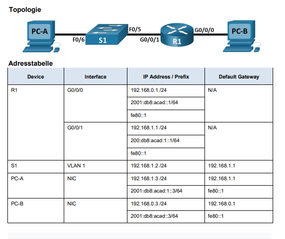
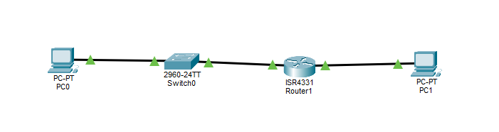
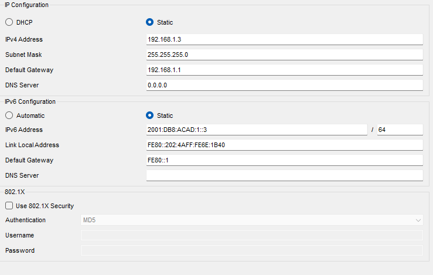
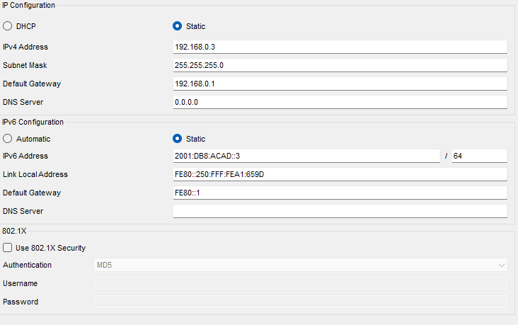
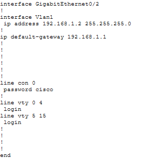
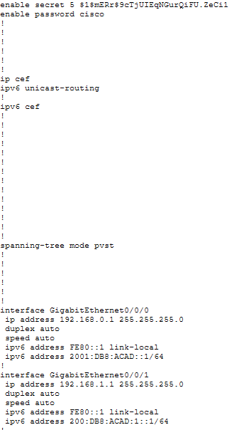
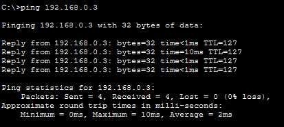
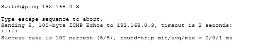

# Arbeitsbericht

- Name: Denis Ermurachi
- Datum: 21.09.2026
- Laborübung: 1
- Fach: SYTD
- Klasse: 4AHITS

## Topologie:



## Ziele:

- Teil 1: Einrichten der Topologie und Initialisieren von Geräten



- Teil 2: Konfigurieren von Geräten und Überprüfen der Konnektivität

    **Konfigurationen der Geräte:**

    | PC-A | PC-B | 
    |----------|----------|
    |    |    | 

    |    S1    |    R1    |
    |----------|----------|
    |  |  |

    _Befehle für S1 Konfiguration_
    ```bash
    S1# conf t
    S1(config)# int vlan1
    S1(config-if)# ip addr 192.168.1.2 255.255.255.0
    S1(config-if)# exit
    
    S1(config)#ip default-gateway 192.168.1.1 
    S1(config)# sdm prefer dual-ipv4-and-ipv6 default
    S1(config)# line console 0
    S1(config-line)# password cisco
    S1(config-line)# login
    S1(config-line)# exit

    S1(config)# enable secret class
    S1(config)# end

    S1# copy running-config startup-config 
    ```

    _Befehle für R1 Konfiguration:_
    ```bash
    R1# conf t
    R1(config)# int g0/0/0
    R1(config-if)# ip addr 192.168.0.1 255.255.255.0
    R1(config-if)# ipv6 addr 2001:db8:acad::1/64 
    R1(config-if)# ipv6 addr fe80::1 link-local
    R1(config-if)# no shutdown
    R1(config-if)# exit

    R1(config)# int g0/0/1
    R1(config-if)# ip addr 192.168.1.1 255.255.255.0
    R1(config-if)# ipv6 addr 200:db8:acad:1::1/64
    R1(config-if)# ipv6 addr fe80::1 link-local
    R1(config-if)# no shutdown
    R1(config-if)# exit

    R1(config)# line console 0
    R1(config-line)# password cisco
    R1(config-line)# login
    R1(config-line)# exit
    R1(config)# enable secret class
    R1(config)# end

    R1# copy running-config startup-config 
    ```

    **Überprüfen der Konnektivität:**

    | PC-A -> PC-B | S1 -> PC-B | 
    |----------|----------|
    |    |    | 
