# Arbeitsbericht

- Name: Denis Ermurachi
- Datum: 21.09.2026
- Laborübung: 1
- Fach: SYTD
- Klasse: 4AHITS

---

## Topologie:

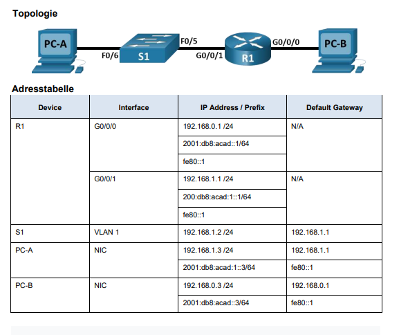

---

## Ziele:

- Teil 1: Einrichten der Topologie und Initialisieren von Geräten

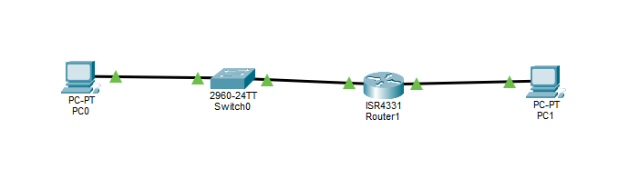

- Teil 2: Konfigurieren von Geräten und Überprüfen der Konnektivität

---

- **Schritt 1** Konfigurationen der Geräte:

    | PC-A | PC-B | 
    |----------|----------|
    | 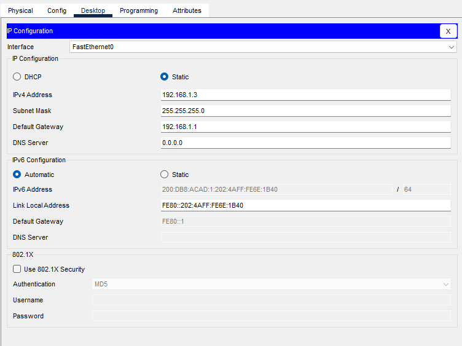   | 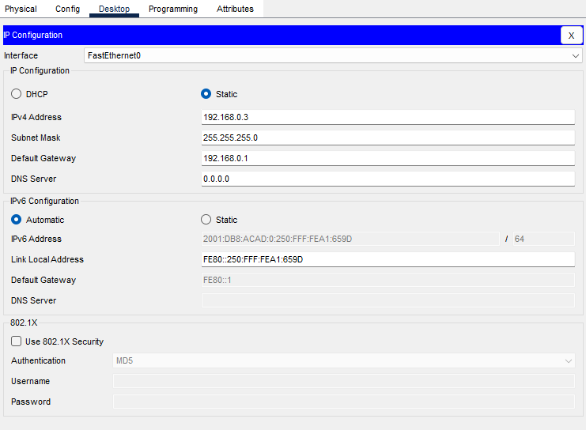   | 

    |    S1    |    R1    |
    |----------|----------|
    | 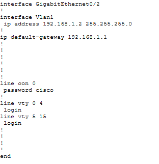 | 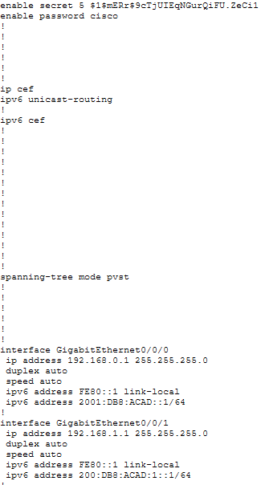 |

    _Befehle für S1 Konfiguration_
    ```bash
    S1# conf t
    S1(config)# int vlan1
    S1(config-if)# ip addr 192.168.1.2 255.255.255.0
    S1(config-if)# exit
    
    S1(config)#ip default-gateway 192.168.1.1 
    S1(config)# sdm prefer dual-ipv4-and-ipv6 default
    S1(config)# line console 0
    S1(config-line)# password cisco
    S1(config-line)# login
    S1(config-line)# exit

    S1(config)# enable secret class
    S1(config)# end

    S1# copy running-config startup-config 
    ```

    _Befehle für R1 Konfiguration:_
    ```bash
    R1# conf t
    R1(config)# int g0/0/0
    R1(config-if)# ip addr 192.168.0.1 255.255.255.0
    R1(config-if)# ipv6 addr 2001:db8:acad::1/64 
    R1(config-if)# ipv6 addr fe80::1 link-local
    R1(config-if)# no shutdown
    R1(config-if)# exit

    R1(config)# int g0/0/1
    R1(config-if)# ip addr 192.168.1.1 255.255.255.0
    R1(config-if)# ipv6 addr 200:db8:acad:1::1/64
    R1(config-if)# ipv6 addr fe80::1 link-local
    R1(config-if)# no shutdown
    R1(config-if)# exit
    R1(config)# ipv6 unicast-routing

    R1(config)# line console 0
    R1(config-line)# password cisco
    R1(config-line)# login
    R1(config-line)# exit
    R1(config)# enable secret class
    R1(config)# end

    R1# copy running-config startup-config 
    ```
---

- **Schritt 2** Überprüfen der Konnektivität:

    | PC-A -> PC-B | S1 -> PC-B | 
    |----------|----------|
    | 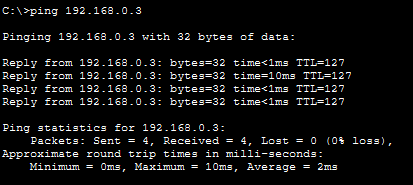   | 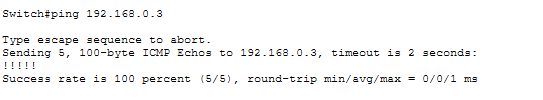   | 
    | 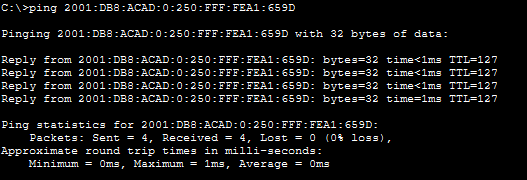   | |

---

- **Schritt 3** Geräteinformationen anzeigen:

    *Router:*
    | show Befehl | Bild |
    |----------|------|
    | ```show ip route``` | 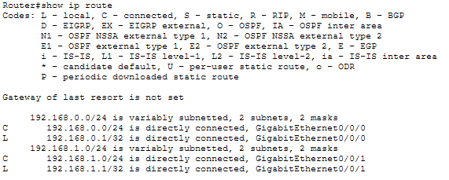 |
    | ```show ipv6 route``` | 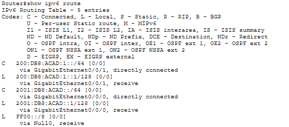 |

    *Switch:*
    | show Befehl | Bild |
    |----------|------|
    | ```show ip interface``` | 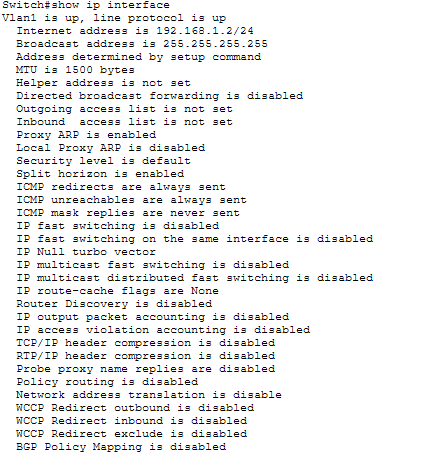 |

---

- **Schritt 4** Zeigen Sie die Routing-Tabelle auf dem Router an

    a. 
    
    
    
    ```
    Welcher Code wird in der Routing-Tabelle verwendet, um ein direkt verbundenes Netzwerk anzuzeigen?
    ```
    **C**
    
    ```
    Wie viele Route-Einträge sind in der Routing-Tabelle mit einem C-Code codiert?
    ```
    **2 Einträge**

    ```
    Welche Schnittstellentypen sind den C-codierten Routen zugeordnet?
    ```
    **GigabitEthernet**
    
    b.

    
    
    ```
    Welcher Code wird in der Routing-Tabelle verwendet, um ein direkt verbundenes Netzwerk anzuzeigen?
    ```
    **C**
    
    ```
    Wie viele Route-Einträge sind in der Routing-Tabelle mit einem C-Code codiert?
    ```
    **2 Einträge**

    ```
    Welche Schnittstellentypen sind den C-codierten Routen zugeordnet?
    ```
    **GigabitEthernet**
---

- **Schritt 5** Schnittstelleninformationen auf dem Router R1 anzeigen.

    a. ```show ip int g0/0/1```

    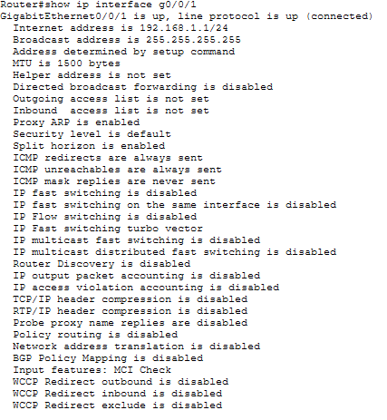

    ```
    Wie ist der Betriebszustand der G0/0/1-Schnittstelle?
    ```
    **up**
    
    ```
    Wie lautet die MAC-Adresse (Media Access Control) der G0/1-Schnittstelle?
    ```    
    **00d0.baa1.ec02 (wurde mit dem Befehl "show interfaces" gefunden)**

    ```
    Wie wird die Internetadresse in diesem Befehl angezeigt?
    ```
    **192.168.1.1/24**

    b. ```show ipv6 int g0/0/1```

    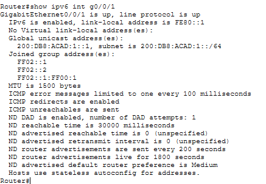

    ```
    Wie ist der Betriebszustand der G0/0/1-Schnittstelle?
    ```
    **up**

    ```
    Wie lautet die MAC-Adresse (Media Access Control) der G0/1-Schnittstelle?
    ```
    **00d0.baa1.ec02 (wurde mit dem Befehl "show interfaces" gefunden)**
    
    ```
    Wie wird die Internetadresse in diesem Befehl angezeigt?
    ```
    **200:DB8:ACAD:1::1**
---

- **Schritt 6** Zeigen Sie eine zusammenfassende Liste der Schnittstellen auf dem Router und Switch an

    ```show ip interface brief```

    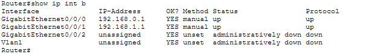

    ```show ipv6 interface brief```

    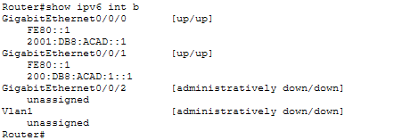

    ```show ip int```

    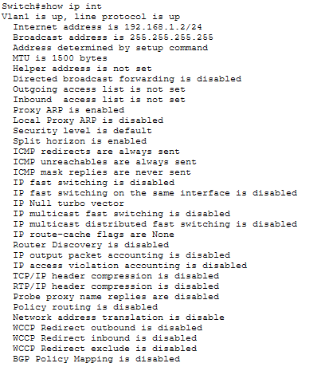

---

**Reflexionsfragen**

1. Wenn die G0/0/1-Schnittstelle anzeigt, dass sie administrativ ausgefallen ist, welchen Schnittstellenkonfigurationsbefehl würden Sie verwenden, um die Schnittstelle wieder hochzufahren?
```no shutdown``` in der Konfiguration der Interface G0/0/1

2. Was würde passieren, wenn Sie die Schnittstelle G0/0/1 auf dem Router mit einer IP Adresse von 192.168.1.2 falsch konfiguriert hätten?
PC-B wäre über den Router nicht erreichbar und könnte selbst nicht auf andere Hosts zugreifen.

---