# Arbeitsbericht

- Name: Denis Ermurachi
- Datum: 28.09.2026
- Laborübung: Standortvernetzung von 2 Standorten
- Fach: SYTD
- Klasse: 4AHITS

---

1) Konfigurationen aller Geräte:

    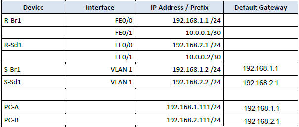

    Am Router R-Br1 nu R-Sd1 werden noch statische Routen benötigt, um die Kommunikation zwischen den beiden Standorten zu ermöglichen.
    
    ---

    R-Br1: 
    ```
        ip route 192.168.1.0 255.255.255.0 10.0.0.2
        ip route 192.168.2.0 255.255.255.0 10.0.0.2 
    ```

    ---

    R-Sd1:
    ```
        ip route 192.168.2.0 255.255.255.0 10.0.0.1
        ip route 192.168.1.0 255.255.255.0 10.0.0.1
    ```

    ---

    **R-Br1**

    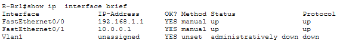

    ---

    **R-Sd1**

    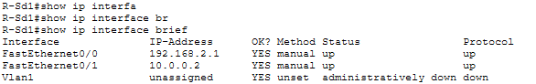

    ---
    
    **S-Br1**

    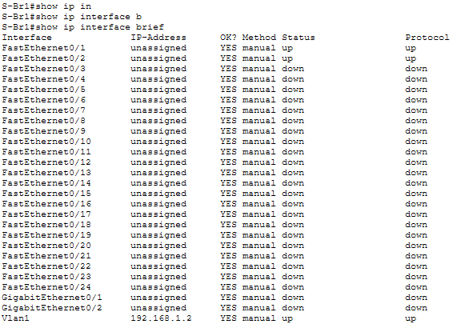

    ---
    
    **S-Br2**

    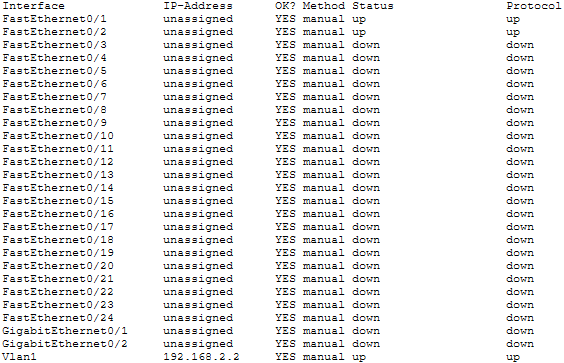

---

2) Überprüfen Sie die End-to-End-Konnektivität:

    **PC-A zu S1/R1:**

    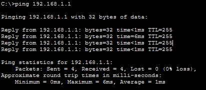

    Mit einem ping auf R1 FE0/0 Schnittstelle wurde die Konnektivität des Switches überprüft.

    ---
    
    **PC-A zu R2/S2:**

    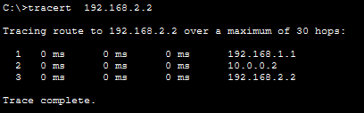

    Mit einem tracert auf R2 FE0/0 Schnittstelle wurde die Konnektivität des R-Br1 und R-Sd1 überprüft.

    ---
    
    **PC-A zu PC-B:**

    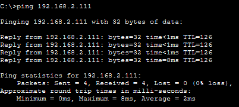

    Mit einem ping auf PC-B wurde die End-to-End-Konnektivität aller Geräte überprüft.

    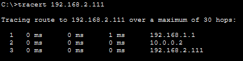

    Der tracert auf PC-B zeigt den vollständigen Pfad der Pakete von PC-A zu PC-B und bestätigt, dass die Routing-Konfigurationen korrekt sind und die End-to-End-Konnektivität funktioniert.

    ---
    
    **PC-B zu PC-A:**

    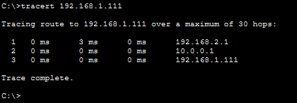

    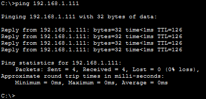

    ping und tracert von PC-B zu PC-A sind ebenfalls erfolgreich.